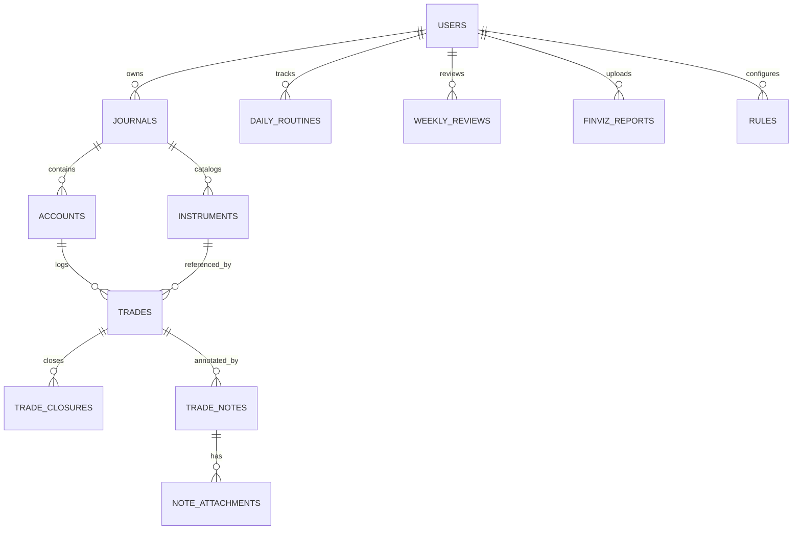

# DATABASE_SCHEMA.md

See also: `FLOW_DIAGRAMS.md` for the visual ER and feature flows.

## ER Diagram

## ORM Strategy (Mandatory)
- Use **Drizzle ORM** for all schema definitions.
- Use **Drizzle Kit** for migrations.
- Keep one logical schema model and generate migrations per backend:
  - SQLite (Phase 1)
  - PostgreSQL/Supabase (Phase 2+)

## Core Tables
- `users` (phase 2+)
- `journals`
- `accounts`
- `trades`
- `trade_closures`
- `trade_notes`
- `note_attachments`
- `daily_routines`
- `weekly_reviews`
- `finviz_reports`
- `rules`

## Journal Scoping Rules
- `journals.user_id` defines ownership.
- `accounts.journal_id` is required.
- Trade records must belong to an account that belongs to the active journal.
- Analytics and routines must always be filtered by journal context.

## Instrument Catalog Rules
- Required fields:
  - `ticker` (e.g., `NQ`, `XAUUSD`, `AAPL`)
  - `instrument_type` (Forex, Index CFD, Stock, Futures, ETF, Crypto)
  - `default_leverage`
  - `min_lot`
  - `lot_step`
  - `market_timezone`
  - `session_open_time`
  - `session_close_time`
- Recommended fields:
  - `contract_size`
  - `tick_size`
  - `tick_value`
  - `trading_days` (array/set)
- Uniqueness:
  - unique per journal on (`journal_id`, `ticker`)

## Trade + Closure Rules
- `trades.position_size > 0`
- `trades.remaining_size >= 0`
- `SUM(trade_closures.closed_size) <= trades.position_size`
- `trades.status` transitions:
  - `open`: no closures yet
  - `partial`: closures exist and `remaining_size > 0`
  - `closed`: `remaining_size = 0`

## Notes + Attachments Rules
- `trade_notes.note_type in ('pre','during','post','closure')`
- `note_attachments.storage_provider in ('local','supabase')`
- Allowed MIME: `image/png`, `image/jpeg`, `image/webp`
- Recommended size limit: 5MB/file

## Indexing Priorities
- `journals(user_id)`
- `trades(account_id, trade_date)`
- `trades(status)`
- `trade_closures(trade_id, closed_at)`
- `trade_notes(trade_id, note_type)`
- `note_attachments(note_id)`
- `instruments(journal_id, ticker)`

## Migration Policy
- Never edit past migration files after release.
- Add forward-only migration for each schema change.
- Document backfill scripts if aggregates are introduced/changed.
