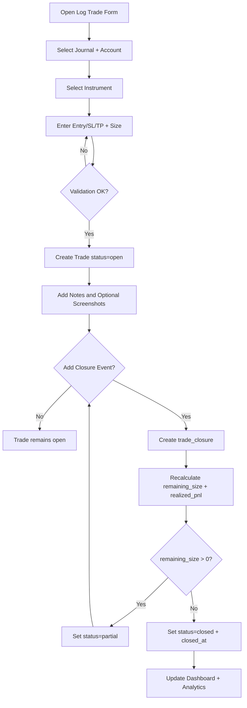
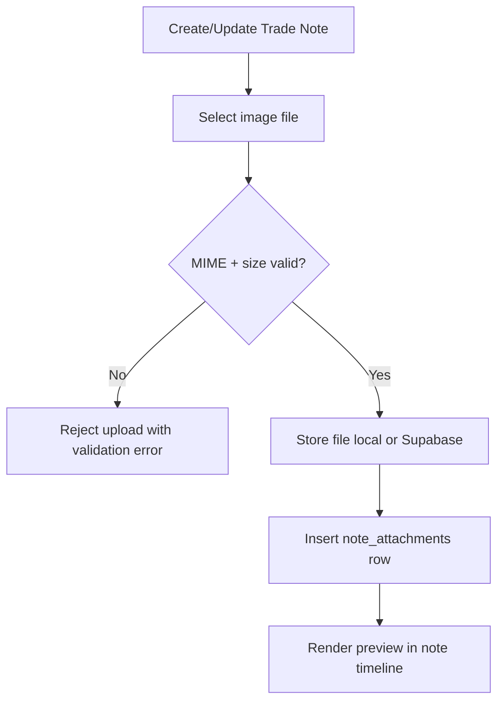
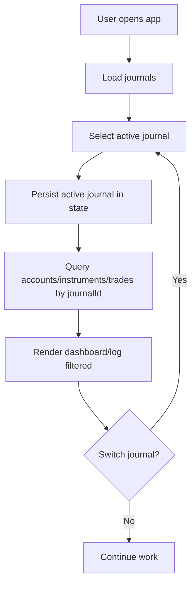
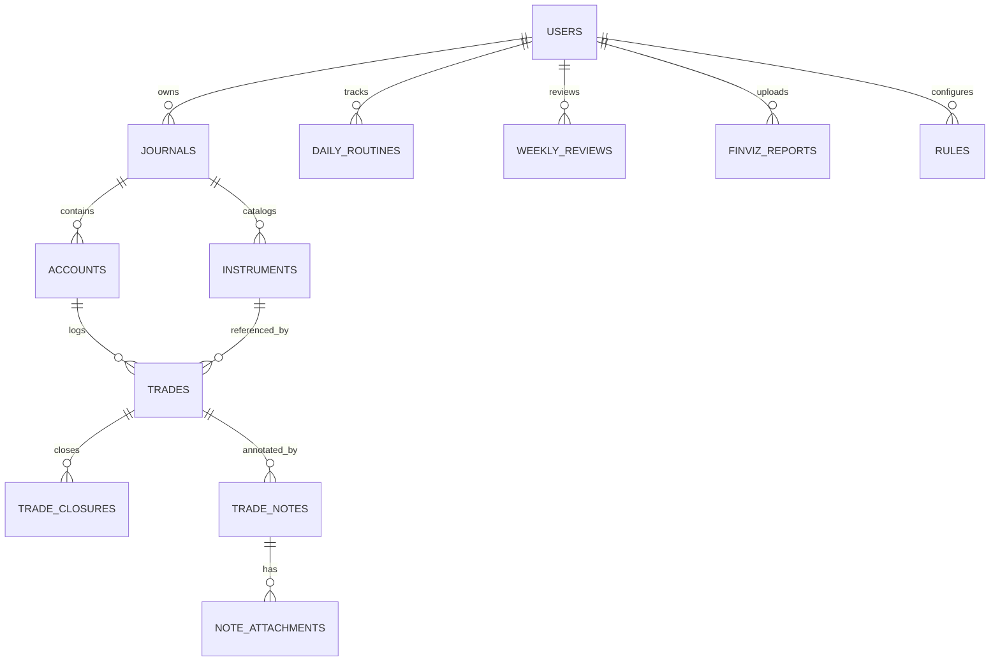

# Flow Diagrams

## Trade Lifecycle (with partial closures)

```mermaid
flowchart TD
  A[Open Log Trade Form] --> B[Select Journal + Account]
  B --> C[Select Instrument]
  C --> D[Enter Entry/SL/TP + Size]
  D --> E{Validation OK?}
  E -- No --> D
  E -- Yes --> F[Create Trade status=open]
  F --> G[Add Notes and Optional Screenshots]
  G --> H{Add Closure Event?}
  H -- No --> I[Trade remains open]
  H -- Yes --> J[Create trade_closure]
  J --> K[Recalculate remaining_size + realized_pnl]
  K --> L{remaining_size > 0?}
  L -- Yes --> M[Set status=partial]
  L -- No --> N[Set status=closed + closed_at]
  M --> H
  N --> O[Update Dashboard + Analytics]
```

## Notes + Attachment Upload

```mermaid
flowchart TD
  A[Create/Update Trade Note] --> B[Select image file]
  B --> C{MIME + size valid?}
  C -- No --> D[Reject upload with validation error]
  C -- Yes --> E[Store file local or Supabase]
  E --> F[Insert note_attachments row]
  F --> G[Render preview in note timeline]
```

## Multi-Journal Context Switching

```mermaid
flowchart TD
  A[User opens app] --> B[Load journals]
  B --> C[Select active journal]
  C --> D[Persist active journal in state]
  D --> E[Query accounts/instruments/trades by journalId]
  E --> F[Render dashboard/log filtered]
  F --> G{Switch journal?}
  G -- Yes --> C
  G -- No --> H[Continue work]
```

## DB Structure (high-level)

```mermaid
erDiagram
  USERS ||--o{ JOURNALS : owns
  JOURNALS ||--o{ ACCOUNTS : contains
  JOURNALS ||--o{ INSTRUMENTS : catalogs
  ACCOUNTS ||--o{ TRADES : logs
  INSTRUMENTS ||--o{ TRADES : referenced_by
  TRADES ||--o{ TRADE_CLOSURES : closes
  TRADES ||--o{ TRADE_NOTES : annotated_by
  TRADE_NOTES ||--o{ NOTE_ATTACHMENTS : has
  USERS ||--o{ DAILY_ROUTINES : tracks
  USERS ||--o{ WEEKLY_REVIEWS : reviews
  USERS ||--o{ FINVIZ_REPORTS : uploads
  USERS ||--o{ RULES : configures
```
